# Diabetes Tracker Mobile App

A professional mobile application built with Flutter, Laravel, and BLoC.

## App Screenshots

### 1. Registration Screen
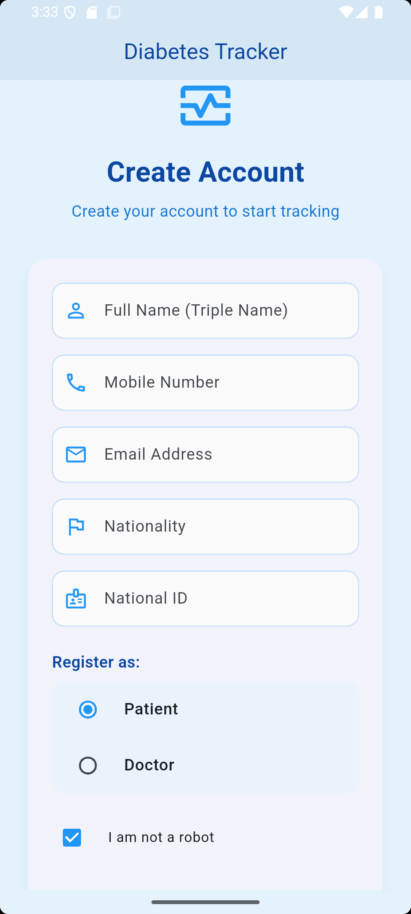

### 2. Login page
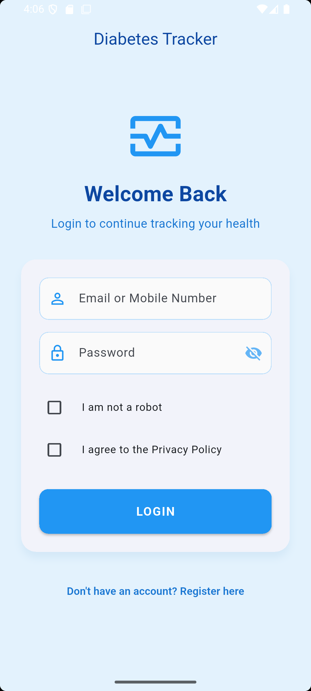

### 3. Home page
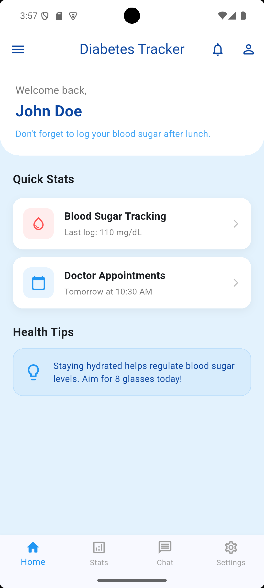

### 4.
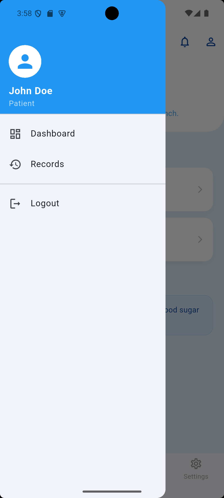

### 5.
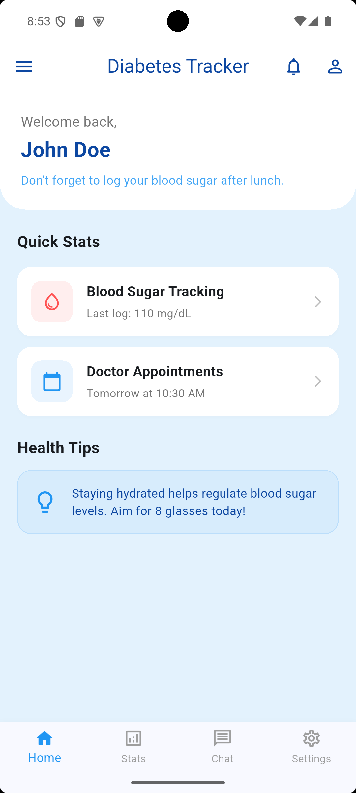

### 6. Blood sugar track
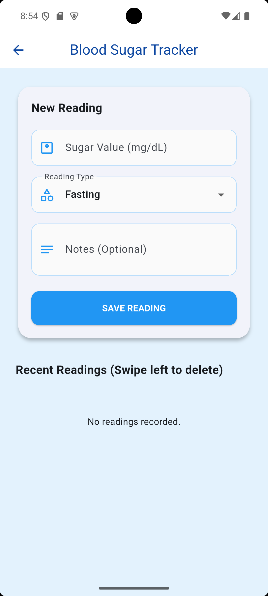

### 7. 
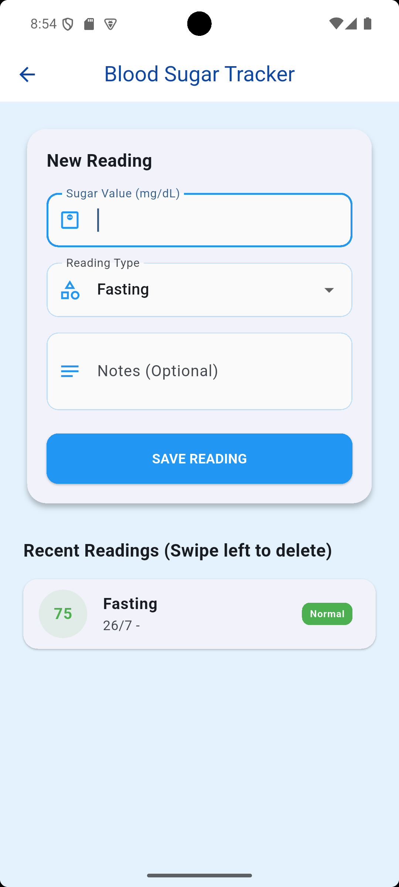

### 8.
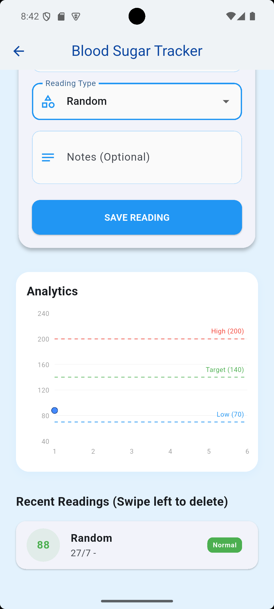

### 9. Doctor appointment 
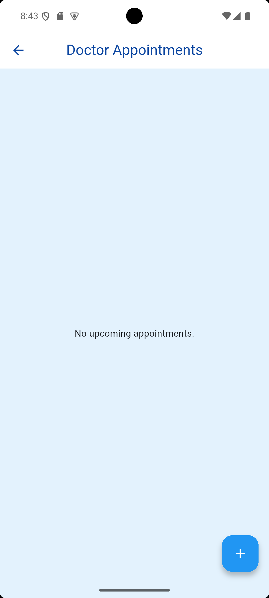

### 10.
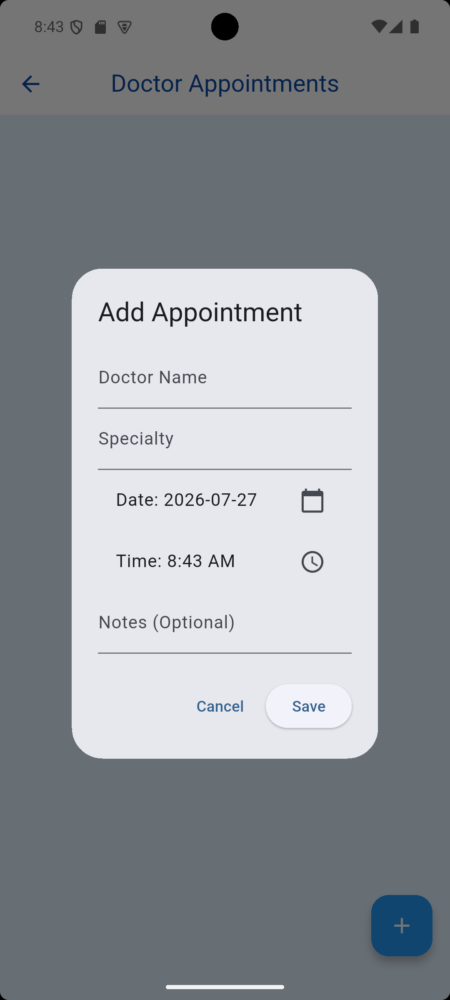

### 11. Sitting 
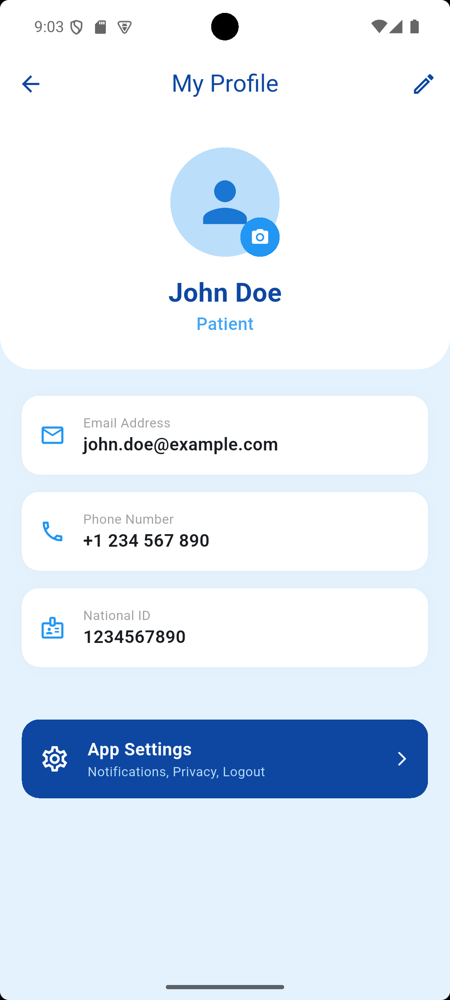

### 12. edit profile 
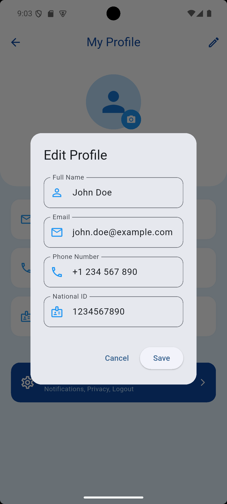

### 13. Screen Title
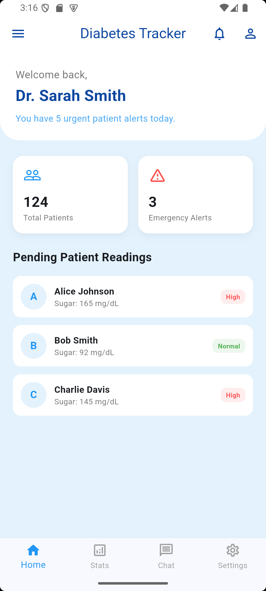
